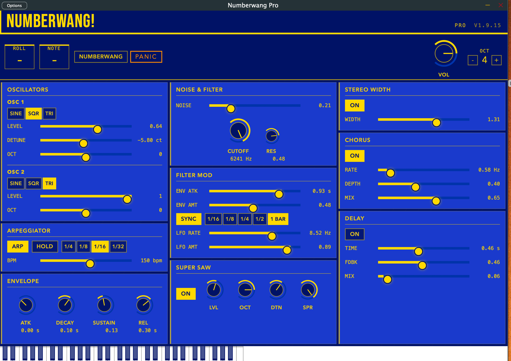

# Numberwang Pro

A polyphonic synthesizer VST3 plugin built with JUCE. Features a WebView-based HTML/CSS/JS UI, an arpeggiator, dual oscillators, filter with envelope and LFO modulation, super saw, chorus, delay, and stereo widener — plus the Numberwang game engine.



---

## Building

### Prerequisites

- macOS (tested on macOS 14+)
- Xcode command line tools (`xcode-select --install`)
- CMake 3.22+
- JUCE (included as a subdirectory — run `git submodule update --init` if it's empty)
- `gh` CLI for releases (`brew install gh`)
- `ccache` for fast incremental builds (`brew install ccache`)

### First-time setup

```bash
cmake -B build -DCMAKE_BUILD_TYPE=Release
```

### Release build (VST3 + Standalone)

```bash
./build.sh
```

This auto-bumps the patch version in `CMakeLists.txt`, rebuilds everything with UI files baked into the binary, and installs the VST3 to the path set by `VST3_COPY_DIR` in `CMakeLists.txt`.

Use `--minor` or `--major` for larger version bumps:

```bash
./build.sh --minor "New feature description"
```

### Dev mode (fast UI iteration)

```bash
./dev.sh
```

Builds the Standalone once with `NUMBERWANG_DEV_UI=ON`. After that, HTML/CSS/JS changes in `Source/UI/` are live after a standalone relaunch — no rebuild needed (~2s vs ~38s).

To return to release builds:

```bash
cmake -B build -DNUMBERWANG_DEV_UI=OFF
./build.sh
```

---

## Project structure

```
Source/
  PluginProcessor.cpp/h   Audio engine, APVTS parameters, synth voices, FX
  PluginEditor.cpp/h      WebView host, parameter relay wiring, native functions
  SynthVoice.h            Per-voice oscillators, filter, ADSR envelope
  UI/
    index.html            UI markup
    style.css             Styling
    app.js                Parameter bindings, knob logic, keyboard input
    juce_frontend.js      JUCE-provided JS bridge (do not edit)
Assets/
  BebasNeue-Regular.ttf   Banner font (baked into binary)
```

---

## Releasing

From inside Claude Code, run:

```
/release
```

This reconfigures for release, bumps the version, builds, commits, tags, pushes, and creates a GitHub release with the VST3 zip attached.

---

## Installing

Download the latest `Numberwang-Pro-vX.Y.Z-macOS.vst3.zip` from [Releases](../../releases), unzip, and copy to:

```
~/Library/Audio/Plug-Ins/VST3/
```
